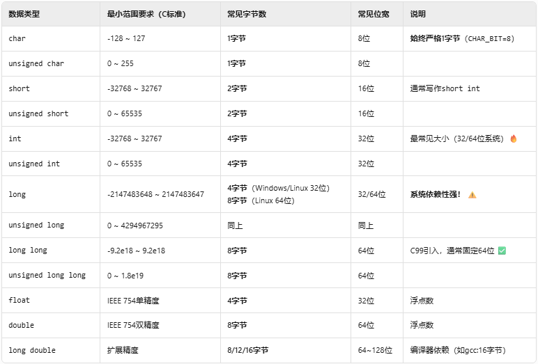
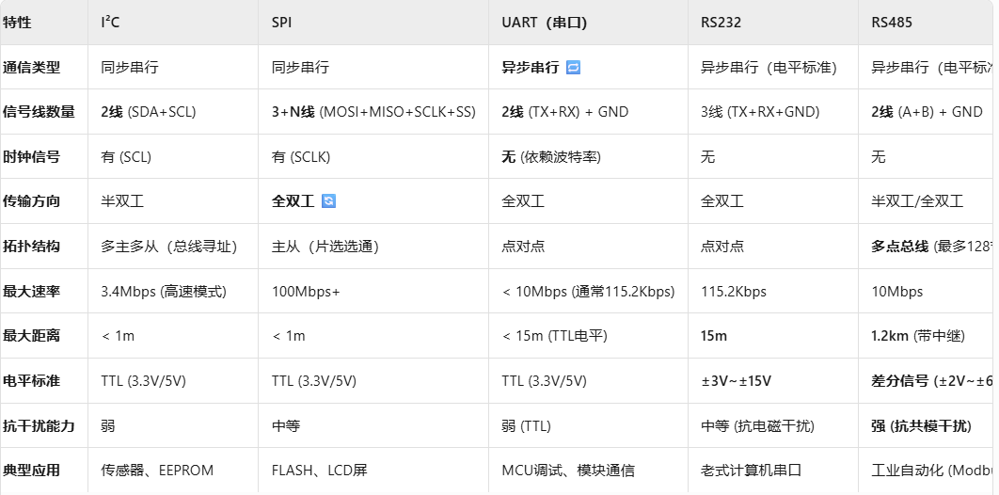
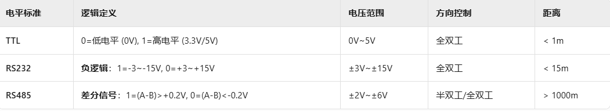
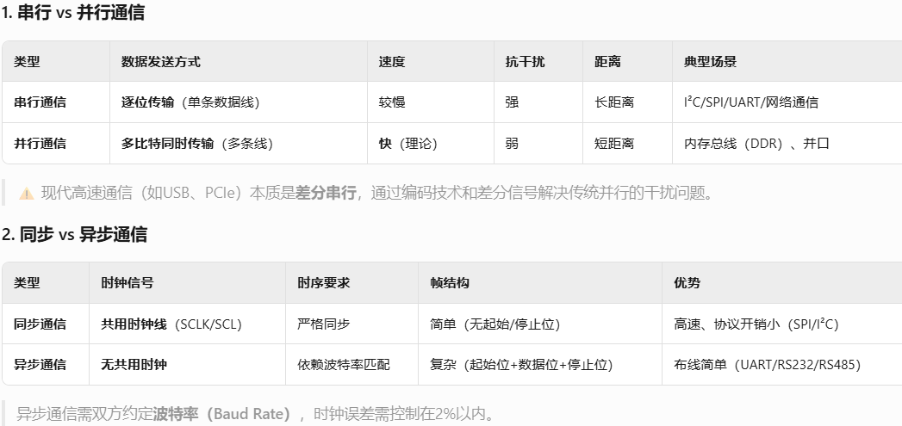
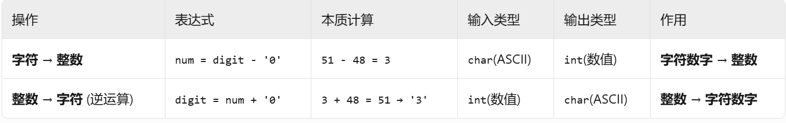
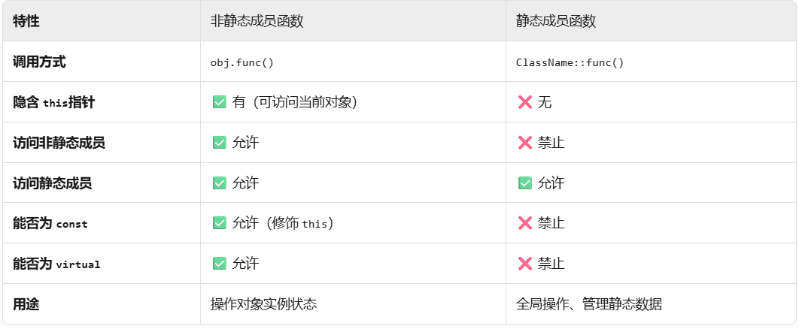

# 学习笔记


1.编译四步骤：编译预处理、编译、汇编、链接

2.数据类型大小

C语言设计原则是??高效利用硬件??，因此类型大小由编译器根据目标硬件决定（只要满足标准的最小范围）。

           16位操作系统：long：4字节，int：2字节
           32位操作系统：long：4字节，int：4字节
           64位操作系统：long：8字节，int：4字节

3.I2C、SPI、UART区别：

并行/串行
异步串行/同步串行：同步通信有时钟，异步通信有起始位
单工（广播、显示器接口、遥控器）/半双工（I2C）/全双工（电话、网口、UART）

?   ?TTL、RS232、RS485??都是基于UART协议，只是物理电平不同。UART本身是协议，而TTL、RS232、RS485是电平标准。
?   ?同步通信??需要时钟线，因此速度通常可以做得更高；??异步通信??不需要时钟线，但需要双方约定波特率（可能存在微小误差，故高速时对时钟精度要求高）。
?   ?串行通信??虽然速度在理论上低于并行通信，但由于抗干扰能力强、布线简单、成本低，已成为远距离通信的主流。



```cpp
{
    #include <cmath>
    double result = pow(10, i);  // 返回 double 
    int intResult = static\_cast\<int>(pow(10, i));  // 强制转换
}
```
2.字符数字转换

```cpp

    string num1;
    `num1[i] - '0'`
```
3.c++静态成员函数

